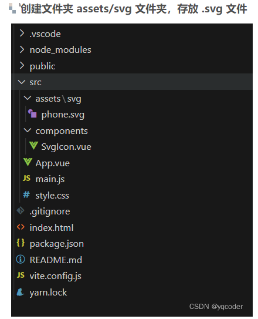
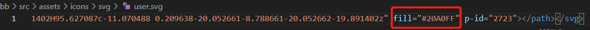

### 1.



### 2.安装依赖

```js
npm install vite-plugin-svg-icons
npm install fast-glob
```

### 3.vite.config.js 编写

```js
import { resolve } from "path";
import { createSvgIconsPlugin } from "vite-plugin-svg-icons";


// plugins配置
plugins: [
    vue(),
    createSvgIconsPlugin({
      // 指定缓存文件
      iconDirs: [resolve(process.cwd(), "src/assets/svg")],
      // 指定symbolId格式
      symbolId: "icon-[dir]-[name]",
    }),
  ],


```

### 4. main.js 编写

```js
// svg 组件
import SvgIcon from "@/components/SvgIcon.vue"
import "virtual:svg-icons-register"
```

### 5.使用

```js
<script setup>
</script>
 
<template>
  <div id="app">
    <!--  name: 必填 svg 的文件名
          className: 选填 class 类名
          color: 选填 颜色
          width: 选填 宽
          height: 选填 高  -->
    <svg-icon name="phone" color="red" width="50" height="50"></svg-icon>
  </div>
</template>
 
<style scoped>
</style>
```

### 6.特别提示：如果 color 属性无效，需删除 .svg 文件里 fill="" 属性

