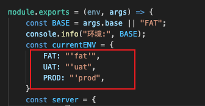

`webpack.DefinePlugin` 插件会在构建过程中将 `defineObj` 中定义的常量注入到所有模块中(包括入口index.html)。 这意味着，所有模块都可以访问这些常量。

```js
// webpack.config.js
	let defineObj = {
        isDevMode: isDevMode,
				appMQTTName: server[BASE].APP_MQTT_NAME,
        appMQTTPassword: server[BASE].APP_MQTT_PASSWORD
   }
  
  plugins: [
			new webpack.DefinePlugin(defineObj)
  ]
  

//index.js
console.log(appMQTTName);
```

#### 注意



在全局使用变量时定义的字符串以这种格式进行定义 
