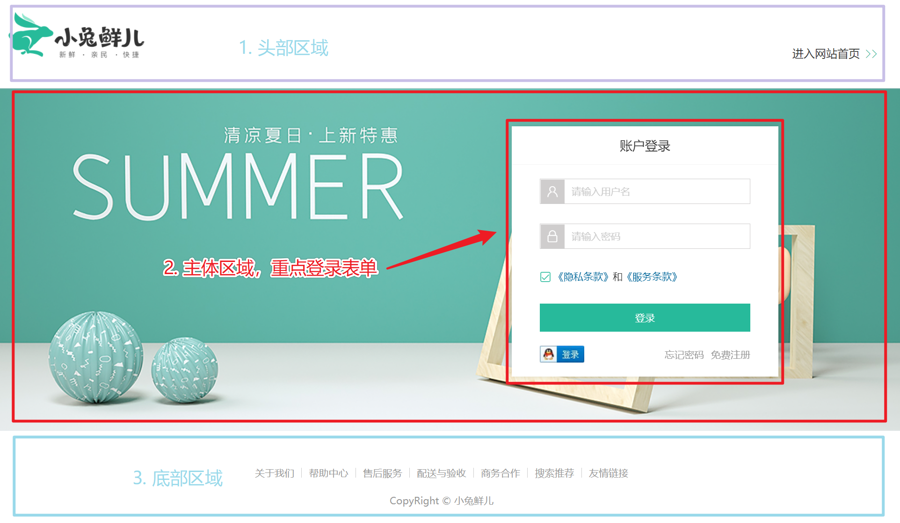
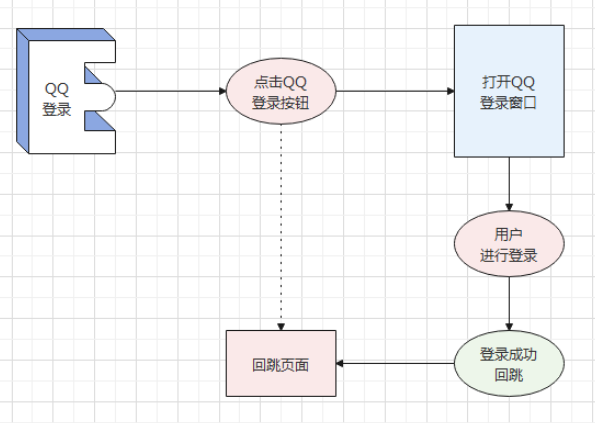
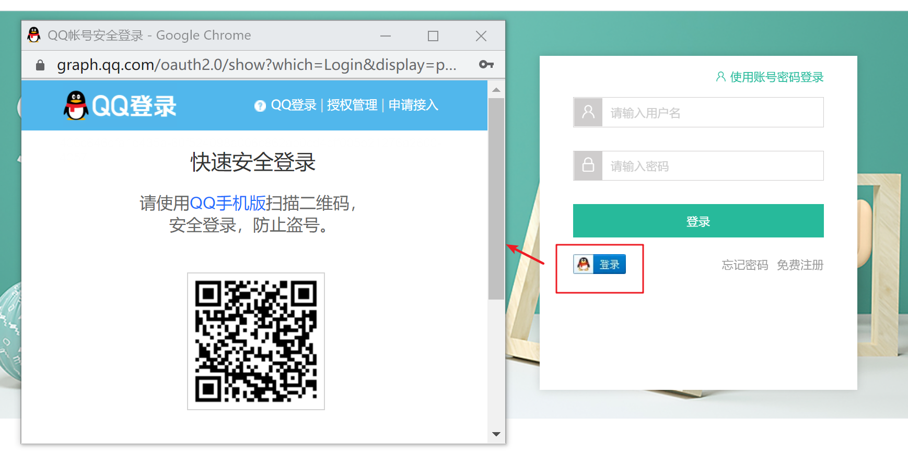
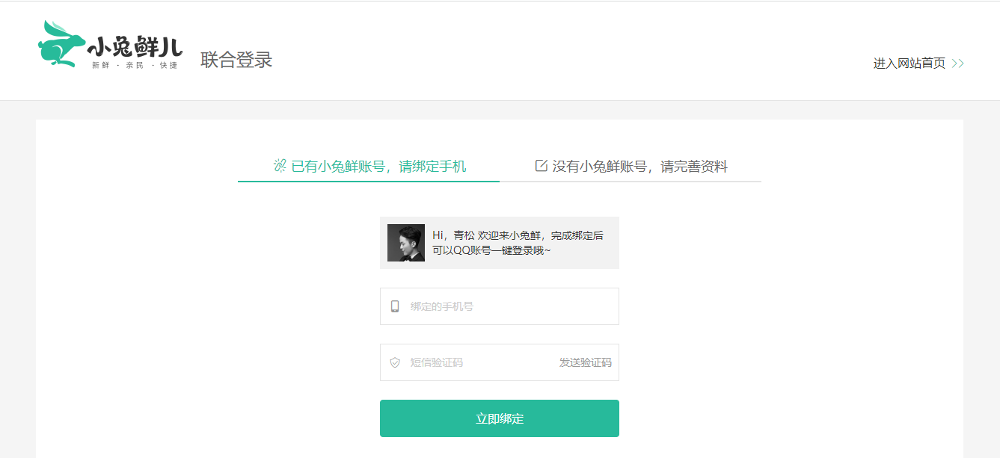
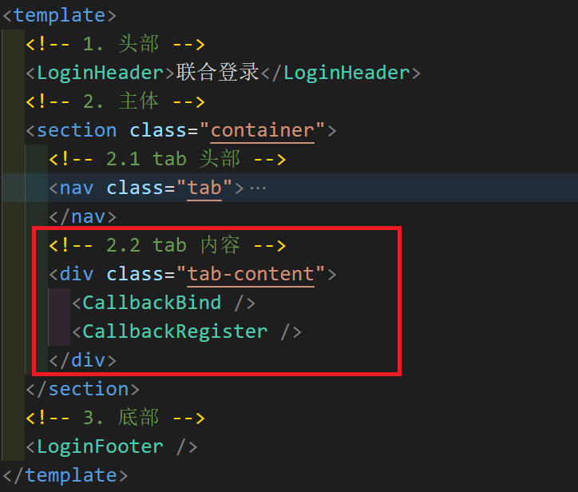
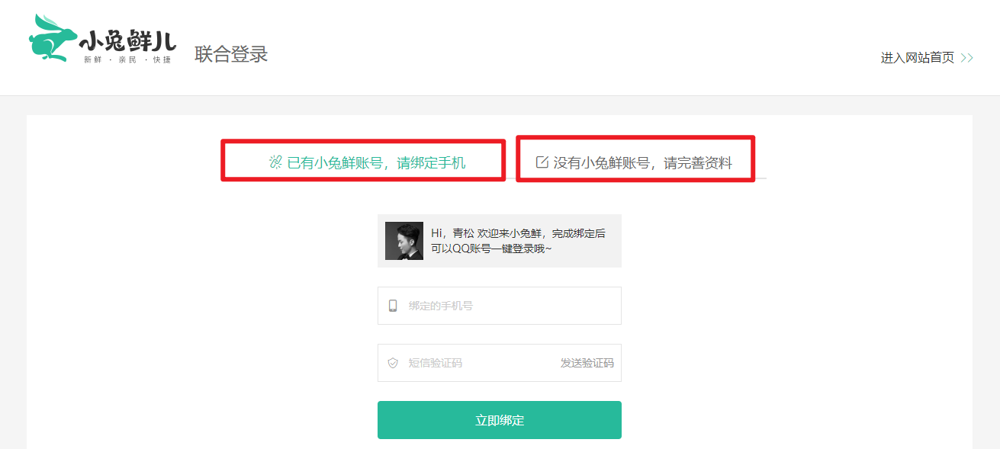
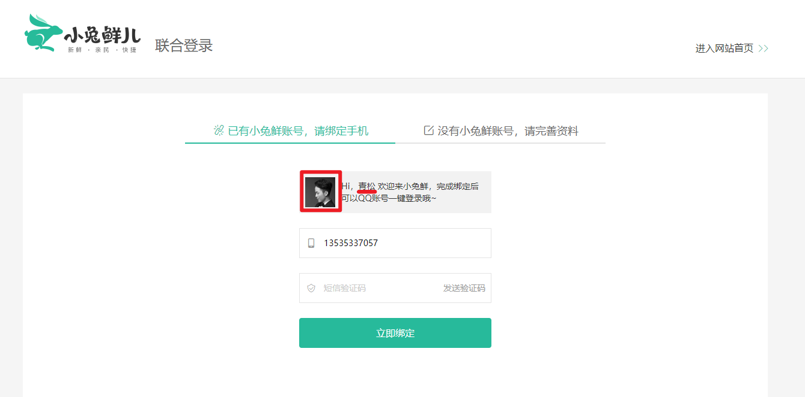
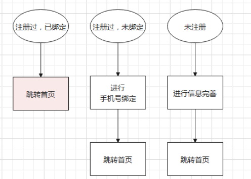
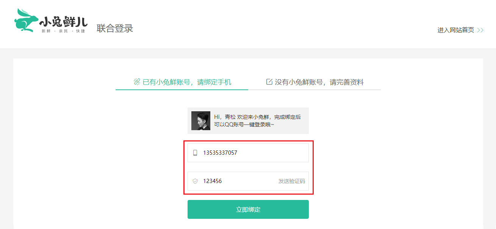

# 登录模块

##   路由与组件

> 目标：登录组件在书写一级路由的时候已经准备，添加路由链接跳转到登录页即可。

- 添加全局路由组件类型声明文件 `src/components.d.ts`
- 拓展阅读：[说明文档](https://github.com/johnsoncodehk/volar/blob/master/extensions/vscode-vue-language-features/README.md)

```ts
// components.d.ts
declare module "@vue/runtime-core" {
  // 全局组件提示 for Voloar
  export interface GlobalComponents {
    RouterLink: typeof import("vue-router")["RouterLink"];
    RouterView: typeof import("vue-router")["RouterView"];
  }
}

export {};
```

- 添加跳转链接：`src/components/app-topnav.vue`

```html
<li><RouterLink to="/login">请先登录</RouterLink></li>
```

### 结构布局-CV




静态结构参考代码 - CV

```vue
<script setup lang="ts">
//
</script>

<template>
  <div class="page-login">
    <!-- 1. 头部 -->
    <header class="login-header">
      <div class="container">
        <h1 class="logo"><RouterLink to="/">小兔鲜</RouterLink></h1>
        <h3 class="sub"><slot>欢迎登录</slot></h3>
        <RouterLink class="entry" to="/">
          进入网站首页
          <i class="iconfont icon-angle-right"></i>
          <i class="iconfont icon-angle-right"></i>
        </RouterLink>
      </div>
    </header>
    <!-- 2. 主体登录区域 -->
    <section class="login-section">
      <div class="wrapper">
        <nav>
          <a href="javascript:;">账户登录</a>
        </nav>
        <LoginForm />
      </div>
    </section>
    <!-- 3. 底部 -->
    <footer class="login-footer">
      <div class="container">
        <p>
          <a href="javascript:;">关于我们</a>
          <a href="javascript:;">帮助中心</a>
          <a href="javascript:;">售后服务</a>
          <a href="javascript:;">配送与验收</a>
          <a href="javascript:;">商务合作</a>
          <a href="javascript:;">搜索推荐</a>
          <a href="javascript:;">友情链接</a>
        </p>
        <p>CopyRight &copy; 小兔鲜儿</p>
      </div>
    </footer>
  </div>
</template>

<style scoped lang="less">
// 头部样式
.login-header {
  background: #fff;
  border-bottom: 1px solid #e4e4e4;
  .container {
    display: flex;
    align-items: flex-end;
    justify-content: space-between;
  }
  .logo {
    width: 200px;
    a {
      display: block;
      height: 132px;
      width: 100%;
      text-indent: -9999px;
      background: url(@/assets/images/logo.png) no-repeat center 18px / contain;
    }
  }
  .sub {
    flex: 1;
    font-size: 24px;
    font-weight: normal;
    margin-bottom: 38px;
    margin-left: 20px;
    color: #666;
  }
  .entry {
    width: 120px;
    margin-bottom: 38px;
    font-size: 16px;
    i {
      font-size: 14px;
      color: @xtxColor;
      letter-spacing: -5px;
    }
  }
}
// 主体样式
.login-section {
  background: url(@/assets/images/login-bg.png) no-repeat center / cover;
  height: 488px;
  position: relative;
  .wrapper {
    width: 380px;
    background: #fff;
    position: absolute;
    left: 50%;
    top: 54px;
    transform: translate3d(100px, 0, 0);
    box-shadow: 0 0 10px rgba(0, 0, 0, 0.15);
    nav {
      font-size: 14px;
      height: 55px;
      margin-bottom: 20px;
      border-bottom: 1px solid #f5f5f5;
      display: flex;
      padding: 0 40px;
      text-align: right;
      align-items: center;
      a {
        flex: 1;
        line-height: 1;
        display: inline-block;
        font-size: 18px;
        position: relative;
        text-align: center;
      }
    }
  }
}

// 底部样式
.login-footer {
  padding: 30px 0 50px;
  background: #fff;
  p {
    text-align: center;
    color: #999;
    padding-top: 20px;
    a {
      line-height: 1;
      padding: 0 10px;
      color: #999;
      display: inline-block;
      ~ a {
        border-left: 1px solid #ccc;
      }
    }
  }
}
</style>

```

### 表单布局-CV

> 目标： 实现登录页面的整体大结构布局

- 新建表单组件

`src/views/Login/components/login-form.vue`

```html
<script setup lang="ts">
// 
</script>

<template>
  <div class="account-box">
    <div class="form">
      <div class="form-item">
        <div class="input">
          <i class="iconfont icon-user"></i>
          <input type="text" placeholder="请输入用户名或手机号" />
        </div>
        <!-- 表单验证错误信息提示 -->
        <!-- <div class="error"><i class="iconfont icon-warning" />请输入手机号</div> -->
      </div>
      <div class="form-item">
        <div class="input">
          <i class="iconfont icon-lock"></i>
          <input type="password" placeholder="请输入密码" />
        </div>
      </div>
      <div class="form-item">
        <div class="agree">
          <XtxCheckBox />
          <span>我已同意</span>
          <a href="javascript:;">《隐私条款》</a>
          <span>和</span>
          <a href="javascript:;">《服务条款》</a>
        </div>
      </div>
      <a href="javascript:;" class="btn">登录</a>
    </div>
    <div class="action">
      
      <div class="url">
        <a href="javascript:;">忘记密码</a>
        <a href="javascript:;">免费注册</a>
      </div>
    </div>
  </div>
</template>

<style lang="less" scoped>
// 账号容器
.account-box {
  .toggle {
    padding: 15px 40px;
    text-align: right;
    a {
      color: @xtxColor;
      i {
        font-size: 14px;
      }
    }
  }
  .form {
    padding: 0 20px;
    &-item {
      margin-bottom: 28px;
      .input {
        position: relative;
        height: 36px;
        > i {
          width: 34px;
          height: 34px;
          background: #cfcdcd;
          color: #fff;
          position: absolute;
          left: 1px;
          top: 1px;
          text-align: center;
          line-height: 34px;
          font-size: 18px;
        }
        input {
          padding-left: 44px;
          border: 1px solid #cfcdcd;
          height: 36px;
          line-height: 36px;
          width: 100%;
          &.error {
            border-color: @priceColor;
          }
          &.active,
          &:focus {
            border-color: @xtxColor;
          }
        }
        .code {
          position: absolute;
          right: 1px;
          top: 1px;
          text-align: center;
          line-height: 34px;
          font-size: 14px;
          background: #f5f5f5;
          color: #666;
          width: 90px;
          height: 34px;
          cursor: pointer;
        }
      }
      > .error {
        position: absolute;
        font-size: 12px;
        line-height: 28px;
        color: @priceColor;
        i {
          font-size: 14px;
          margin-right: 2px;
        }
      }
    }
    .agree {
      a {
        color: #069;
      }
    }
    .btn {
      display: block;
      width: 100%;
      height: 40px;
      color: #fff;
      text-align: center;
      line-height: 40px;
      background: @xtxColor;
      &.disabled {
        background: #cfcdcd;
      }
    }
  }
  .action {
    padding: 20px 40px;
    display: flex;
    justify-content: space-between;
    align-items: center;
    .url {
      a {
        color: #999;
        margin-left: 10px;
      }
    }
  }
}
</style>
```

登录模块入口组件  `src/views/Login/index.vue`

> 在主体登录区域引入并使用表单组件。

```vue
<script setup lang="ts">
import LoginForm from "./components/login-form.vue";
</script>

<template>
  <div class="page-login">
    <!-- 1. 头部 -->
    <header class="login-header">
      ....
    </header>
    <!-- 2. 主体登录区域 -->
    <section class="login-section">
      <div class="wrapper">
        <nav>
          <a href="javascript:;">账户登录</a>
        </nav>
        <LoginForm />
      </div>
    </section>
    <!-- 3. 底部 -->
    <footer class="login-footer">
      ....
    </footer>
  </div>
</template>
```


## 消息提示组件 和 复选框组件

### 组件外观


### XtxCheckBox 组件使用

```vue
<script setup lang="ts">
import { ref } from "vue";

const isAgree = ref(false);
</script>


<XtxCheckBox v-model="isAgree">我已同意</XtxCheckBox>
```

### Message 组件使用

> Message 组件支持  函数  和 组件 两种调用方式：

#### 函数调用 - 推荐👍

- 调用函数时由函数内部动态创建组件，使用完成自动卸载

```vue
<script setup lang="ts">
import { message } from "@/components/XtxUI/Message/index";

message({ type: "success", text: "登录成功", time: 2000});
</script>
```

- 组件库代码升级： `src\components\XtxUI\index.ts` 组件库做统一出口

```ts
// 做统一出口
export * from "./Message/index";
```

- 调用 message 函数变得更方便

```diff
<script setup lang="ts">
-import { message } from "@/components/XtxUI/Message/index";
+import { message } from "@/components/XtxUI";

message({ type: "success", text: "登录成功", time: 2000});
</script>
```

#### 组件使用 - 不推荐

- 通过v-if/v-show  控制显示和隐藏。
- 受父组件定位影响。

```vue
<template>
  <XtxMessage v-if="true" text="登录成功" type="success"></XtxMessage>
  <XtxMessage text="登录失败" type="error"></XtxMessage>
  <XtxMessage text="警告" type="warn"></XtxMessage>
</template>
```


## 登录前表单校验

> 目标：校验之前我们已经实现了很多次，这里弱化验证写法，简单做一个非空检验即可。

### 参考代码

```html
<script setup lang="ts">
import { reactive } from "vue";
import { message } from "@/components/XtxUI";
    
const form = reactive({
  account: "",
  password: "",
});

const login = () => {
  if (form.account === "") {
    message({ type: "error", text: "用户名或手机号不能为空" });
    return;
  }
  if (form.password === "") {
    message({ type: "error", text: "密码不能为空" });
    return;
  }
  if (!isAgree.value) {
    message({ type: "error", text: "请同意许可" });
    return;
  }
  console.log("通过校验，可以发送请求");
};
</script>


// 📌 绑定 form 响应式数据到表单元素中
<input v-model="form.account" type="text" placeholder="请输入用户名或手机号" />
<input v-model="form.password" type="password" placeholder="请输入密码" />
<XtxCheckBox v-model="isAgree">我已同意</XtxCheckBox>

// 📌 登录按钮
<a href="javascript:;" class="btn" @click="login">登录</a>
```


## 会员 Pinia 状态管理

### 新建 Strore

新建文件： `src\store\modules\member.ts`

```ts
import { defineStore } from "pinia";

const useMemberStore = defineStore({
  id: "member",
  // 状态
  state: () => ({}),
  // 计算
  getters: {},
  // 方法
  actions: {},
});

export default useMemberStore;

```

### 合并 Store

修改文件：`src\store\index.ts`

```diff
import useHomeStore from "./modules/home";
+import useMemberStore from "./modules/member";

const useStore = () => {
  return {
    home: useHomeStore(),
+    member: useMemberStore(),
  };
};

export default useStore;
```

- 调试工具检查 Pinia。

## 账户登录实现

> `本节目标:`  实现账户名密码登录功能

### 用户名和密码登录接口

**基本信息**

**Path：** /login

**Method：** POST

**接口描述：**

登录成功后，后台返回的token，请在本地保存，并在每次请求接口时在 Header 中携带上。

**请求参数**

**Body**

| 名称     | 类型   | 是否必须 | 默认值 | 备注           | 其他信息          |
| -------- | ------ | -------- | ------ | -------------- | ----------------- |
| account  | string | 必须     |        | 用户名或手机号 | undefined: ceshi  |
| password | string | 必须     |        | 密码           | undefined: 123456 |

### 发送登录请求

修改文件：`src/store/modules/member.ts`

```jsx
import { http } from "@/utils/request";
import { defineStore } from "pinia";

const useMemberStore = defineStore({
  id: "member",
  // 状态
  state: () => ({
    profile: {},
  }),
  // 计算
  getters: {},
  // 方法
  actions: {
    // 用户名和密码登录
    async login(data: { account: string; password: string }) {
      const res = await http("POST", "/login", data);
      console.log("/login", res.data.result);
    },
  },
});

export default useMemberStore;

```

3）登录表单调用

`login-form.vue`

```jsx
<script setup lang="ts">
import { reactive, ref } from "vue";
import useStore from "@/store";

const isAgree = ref(false);
const form = reactive({
  account: "sujiehao",
  password: "123456",
});

const { member } = useStore();
const login = async () => {
  if (form.account === "") {
    return message({ type: "error", text: "用户名或手机号不能为空" });
  }
  if (form.password === "") {
    return message({ type: "error", text: "密码不能为空" });
  }
  if (!isAgree.value) {
    return message({ type: "error", text: "请同意许可" });
  }
  // 发送登录请求
  await member.login(form);
};
</script>

```


### 定义TS类型

新增类型文件：`src\types\api\member.d.ts`

```ts
export interface Profile {
  id: string;
  account: string;
  mobile: string;
  token: string;
  avatar: string;
  nickname: string;
  gender: string;
  birthday?: string;
  cityCode: string;
  provinceCode: string;
  profession: string;
}

```

应用类型：

```ts
import type { Profile } from "@/types";
import { http } from "@/utils/request";
import { defineStore } from "pinia";
import { message } from "@/components/XtxUI";
import router from "@/router";

const useMemberStore = defineStore({
  id: "member",
  // 状态
  state: () => ({
    // 用户信息
    profile: {} as Profile,
  }),
  // 计算
  getters: {
    // 是否登录
    isLogin(): boolean {
      return Boolean(this.profile.token);
    },
  },
  // 方法
  actions: {
    // 用户名和密码登录
    async login(data: { account: string; password: string }) {
      const res = await http<Profile>("POST", "/login", data);
      // 1. 保存用户信息到 state 中
      this.profile = res.data.result;
      // 2. 请求成功给用户提示
      message({ type: "success", text: "登录成功" });
      // 3. 跳转页面，跳转到首页
      router.push('/')  
    },
  },
});

export default useMemberStore;

```

### 用户信息渲染

用户信息渲染：  `Layout/components/app-topnav.vue`

```html
<script setup lang="ts">
import useStore from "@/store";
import { storeToRefs } from "pinia";

const { member } = useStore();
// storeToRefs 解构出来的数据还能保持响应式
const { profile } = storeToRefs(member);
</script>

<template>
  <nav class="app-topnav">
    <div class="container">
      <ul>
        <template v-if="member.isLogin">
          <li>
            <a href="javascript:;">
              <i class="iconfont icon-user"></i>
              {{ profile.nickname || profile.account }}
            </a>
          </li>
          <li><a href="javascript:;">退出登录</a></li>
        </template>
        <template v-else>
          <li><RouterLink to="/login">请先登录</RouterLink></li>
          <li><a href="javascript:;">免费注册</a></li>
        </template>
        ...
      </ul>
    </div>
  </nav>
</template>
```


### 持久化存储

登录成功后，把用户信息保存到本地。(本地和pinia都保存)


#### 封装

```ts
// 用户信息持久化存储
import type { Profile } from "@/types";
const PROFILE_KEY = "rabbit-shop-profile";
// 存储用户信息
export const saveStorageProfile = (profile: Profile) => {
  localStorage.setItem(PROFILE_KEY, JSON.stringify(profile));
};
// 获取用户信息
export const getStorageProfile = (): Profile => {
  return JSON.parse(localStorage.getItem(PROFILE_KEY) || "{}") as Profile;
};
// 清空用户信息
export const clearStorageProfile = () => {
  localStorage.removeItem(PROFILE_KEY);
};
```


#### 使用

```ts
import { http } from "@/utils/request";
import { defineStore } from "pinia";
import type { Profile } from "@/types";
import { message } from "@/components/XtxUI";
// 📌在非 .vue 组件文件中，可通过导入 router 直接获取路由实例
import router from "@/router";
import { getStorageProfile, saveStorageProfile } from "@/utils/storage";

const useMemberStore = defineStore({
  id: "member",
  // 🚨使用插件遇到小问题，自己手写本地存储
  // persist: true,
  // 状态
  state: () => ({
    // 用户资料
    profile: getStorageProfile(),
  }),
  // 计算
  getters: {
    // getters 封装用户是否登录，语义更强
    isLogin(): boolean {
      return Boolean(this.profile.token);
    },
  },
  // 方法
  actions: {
    // 用户名密码登录
    async login(data: { account: string; password: string }) {
      // 发送请求
      const res = await http<Profile>("POST", "/login", data);
      // console.log("/login", res.data.result);
      // 存储到 Pinia 中
      this.profile = res.data.result;
      // 存储到本地
      saveStorageProfile(res.data.result);
      // 登录成功提示
      message({ type: "success", text: "登录成功" });
      // 跳转到首页
      router.push("/");
    },
  },
});

export default useMemberStore;

```


## 退出登录实现

`本节目标:`  实现账户名密码登录功能

1 提供 actions， 清空用户数据 （本地和pinia都清空）

```jsx
actions: {
    // 退出登录
    async logout() {
      // 清空 Pinia 用户信息
      this.profile = {} as Profile;
      // 清空 本地 用户信息
      clearStorageProfile();
      // 跳转到登录页
      router.push("/login");
    },
},
```

2. 页面中调用，并跳转登录页， 记录当前发生退出登录行为时完整地址 fullPath

```html
<template v-if="profile.token">
  <li>
    <a href="javascript:;"><i class="iconfont icon-user"></i>
      {{ profile.nickname || profile.account}}
    </a>
  </li>
  <li><a @click="member.logout()" href="javascript:;">退出登录</a></li>
</template>
```

## 优化：登录成功页面回跳

Test 组件准备

```jsx
<template>
  <RouterLink :to="'/login?target=' + encodeURIComponent($route.fullPath)">
    <XtxButton type="primary"> 请先登录 </XtxButton>
  </RouterLink>
</template>
```

登录成功后跳转处理

```jsx
const useMemberStore = defineStore({
  id: "member",
  ...
  // 方法
  actions: {
    // 用户名密码登录
    async login(data: { account: string; password: string }) {
      ...
      // 🐛 在非 .vue 组件中 useRoute() 返回 undefined，没法使用
      // 📌 解决方案，通过 router 路由实例 currentRoute 获取
      const route = router.currentRoute.value;
      // console.log(route.path);
      if (route.query.target) {
        // 跳转到指定地址
        router.push(decodeURIComponent(route.query.target as string));
      } else {
        // 跳转到首页
        router.push("/");
      }
    },
  },
});

```


## 请求拦截器和响应拦截器

### 响应拦截器 - 请求失败处理🚨

响应拦截器，添加错误提示：

```jsx
import { message } from '@/components/Message'

// 添加响应拦截器
instance.interceptors.response.use(
  function (response) {
    // 如果请求成功成功 2xx 就直接返回 data 中的数据
  return response
 },
 function (error) {
    // 对响应错误做点什么
    if (!error.response) {
      // 网络错误提示
      message({ type: "error", text: "网络错误，请换个网络环境" });
    } else {
      // 对响应错误做点什么 400 401 404 500 ...
      // 通用错误，通用提示
      message({ type: "error", text: error.response.data.message });
    }
    return Promise.reject(error);
})

```

### 请求拦截器 - 携带 token

`utils/request.ts`

```jsx
// 官方说明：https://pinia.vuejs.org/core-concepts/outside-component-usage.html
// ❌ 非组件中，Pinia 常见错误写法
// const { member } = useStore();

// 添加请求拦截器
instance.interceptors.request.use(
  function (config) {
    // 在发送请求之前做些什么
    // ✅ 非组件中，在消费前获取 Store
    const { member } = useStore();
    // 1. 获取token
    const { token } = member.profile;
    // 2. 如果有 token 同时 headers 非空
    if (token && config.headers) {
      // 3. 请求头中携带 token 信息
      config.headers.Authorization = `Bearer ${token}`;
    }
    return config;
  },
  function (error) {
    // 对请求错误做些什么
    return Promise.reject(error);
  }
);
```


## 倒计时逻辑函数封装

> `本节目标:`   封装一个通用的倒计时逻辑函数`useCountDown`

**需求描述**

1. 支持自定义参数传入定制倒计时初始值

   eg: ` useCountDown(60)`

2. 返回当前计数/暂停计时方法/开始计时方法供业务使用

   eg: `const {countTime, start, pause} = useCountDown(60)`

**逻辑实现**

> 参考文档：[https://vueuse.org/shared/useintervalfn/](https://vueuse.org/shared/useintervalfn/)

核心逻辑：每隔一秒钟，对 countTime 进行减 1 操作

1. resume：可执行函数，开启定时器，每隔一个时间执行一次
2. pause： 可执行函数，只要执行这个函数，定时器就会暂停

### 组件中写法

```html
<script setup lang="ts">
import { useIntervalFn } from "@vueuse/core";
import { ref } from "vue";
    
const countTime = ref(0);
const { pause, resume } = useIntervalFn(
  () => {
    countTime.value--;
    if (countTime.value <= 0) {
      pause();
    }
  },
  1000,
  { immediate: false }
);

const start = () => {
  countTime.value = 60;
  resume();
};
</script>

<template>
  <div>
    {{ countTime }}
    <button @click="start">开始定时器</button>
    <button @click="pause">暂停定时器</button>
    <button @click="resume">继续定时器</button>
  </div>
</template>

```

### 封装成 hooks 钩子函数

在 `src\hooks\index.ts` 文件中新增以下代码：

```js
import { useIntervalFn } from "@vueuse/core";

export function useCountDown(startCount = 60) {
  const countTime = ref(0);
  // pause 暂停定时器
  const { pause, resume } = useIntervalFn(
    () => {
      // 倒计时，就是每隔一秒减一
      countTime.value--;
      if (countTime.value <= 0) {
        pause();
      }
    },
    1000,
    { immediate: false }
  );
  // 重新开始（倒计时的数字）
  function start() {
    countTime.value = startCount;
    resume();
  }
  return {
    countTime,
    start,
    pause,
    resume
  };
}
```

test 组件测试

```jsx
<script setup lang="ts">
import { useCountDown } from "@/hooks";
const { countTime, start, pause } = useCountDown(5);
</script>

<template>
  <div>
    {{ countTime }}
  </div>
  <button @click="start">开始倒计时</button>
  <button @click="pause">暂停倒计时</button>
</template>

```

## QQ三方登录 - 前置环境和交互

### 登录简要流程梳理

`本节目标:`   掌握第三方登录的实现流程


1. 在登录页面，QQ登录按钮处，赋予其打开QQ登录页面功能
2. 回跳的页面得到QQ给的唯一标识 openId，根据openId去后台查询是否已经绑定过账户
   - 如果绑定过，完成登录
   - 没有绑定过
     - 有账号的，绑定手机号，即为登录
     - 没账号的，完善账户信息，即为登录
3. 登录成功后，跳转首页，或者来源页面

### 前置工作准备 - 了解

1）参考文档

1. [准备工作(opens new window)](https://wiki.connect.qq.com/准备工作_oauth2-0)
2. [QQ互联JS_SDK(opens new window)](https://wiki.connect.qq.com/js_sdk使用说明#3..E8.87.AA.E5.AE.9A.E4.B9.89.E7.99.BB.E5.BD.95.E6.8C.89.E9.92.AE)

2）大概步骤

1. 准备一个已经**备案**的网站需要有QQ登录的逻辑（登录页面，回跳页面）
2. 然后在QQ互联上进行`身份认证`，并且`审核通过`
3. 在QQ互联上创建应用，应用需要域名，备案号，回调地址等
4. 等待人工审核，审核通过会得到`应用ID` `应用key` `回调地址`
5. 帮大家申请的结果如下：

```sh
# 测试用 appid 
# 100556005
# 测试用 redirect_uri
# http://www.corho.com:8080/#/login/callback
```

### 常见疑问❓

1. 这个申请工作一般由谁去做？
   - 公司的运维 （负责管理公司账号的人）。
2. 申请下来的 id，应用 key，回调地址 uri  能改吗？
   1. 都不能修改，否则无效。
   2. 🐛 回调地址 uri 的包含**四部分**： 1. 域名，2. 端口号  3. 哈希路由模式  4. 路由地址 **都必须完全一致**，否则不能展示。
3. 🚨回调 uri 打开看不到内容？ [http://www.corho.com:8080/#/login/callback](http://www.corho.com:8080/#/login/callback)
   1. 修改 `vite.config.ts` 配置。
   2. 修改电脑的 `host` 文件，访问本地服务器。
   3. 配置 `VueRouter`路由 和 `vue` 组件。

## QQ三方登录-电脑环境设置🚨

> 目标：浏览器访问 http://www.corho.com:8080/#/login/callback 地址，能打开正在开发的 Vue 项目。

### 核心步骤

1. 修改 `vite.config.ts` 配置。
2. 修改电脑的 `host` 文件。
3. 配置 `VueRouter` 和 `vue` 组件。

### 第一步：修改 `vite` 配置

修改 `vite.config.ts` 文件：

```ts
export default defineConfig({
  // 配置开发服务器
  server: {
    // QQ三方登录的回调uri为：http://www.corho.com:8080/#/login/callback
    // vite 中配置： www.corho.com:8080
    host: "www.corho.com",
    port: 8080,
    // 其他有价值的配置项
    open: true, // 帮我们打开浏览器
    cors: true, // 允许开发时 ajax 跨域
  },
  ...
});
```

### 第二步：修改 `host` 文件

#### windows 系统

🔔提醒：修改电脑配置，需要先退出 360 或 各种管家 各种 杀毒软件

🔔提醒：如果修改 hosts 文件有弹窗警告，点击信任（因为这是我们自己进行的安全操作）

```bash
1. 找到 C:\Windows\System32\drivers\etc 下hosts文件
2. 在文件中加入  127.0.0.1       www.corho.com
3. 保存即可
# 如果提示没有权限
1. 将hosts文件移到桌面，然后进行修改，确认保存。
2. 将桌面hosts文件替换c盘文件
```

#### mac OS 系统

```bash
1. 打开命令行窗口
2. 输入：sudo vim /etc/hosts
3. 按下：i 键
4. 输入：127.0.0.1       www.corho.com
5. 按下：esc
6. 按下：shift + :
7. 输入：wq 回车即可
```

📌步骤验证：浏览器访问 [http://www.corho.com:8080/#/](http://www.corho.com:8080/#/) 能看到自己开发的 Vue3 项目表示第二步配置成功。

### 第三步：配置路由和组件

新建组件：`views/Login/callback.vue`

```vue
<script setup lang="ts">
//
</script>

<template>
  <h1>callback-QQ登录回跳页面测试</h1>
</template>

```

配置路由：

2）绑定路由 (一级路由)

```jsx
{
  path: '/login/callback',
  component: () => import('@/views/Login/callback')
},
```

📌步骤验证：[http://www.corho.com:8080/#/login/callback](http://www.corho.com:8080/#/login/callback) 看到回调页面组件。


### DNS 解析概念 - 了解

> 由于本地我们的网站是访问`http://localhost:3000`
>
> 而回调地址的域名是`http://www.corho.com:8080`，俩个地址不一致是无法进行跳转的，
>
> 需要我们修改本地的 hosts 文件，让域名访问时解析到我们本地的ip上
>
> DNS 解析：（网络中，服务器不认域名的，认的是 ip） www.jd.com
>
> 1. 作用是将域名地址解析成ip地址
> 2. 优先级  先以本地的 hosts 文件为主  然后才走线上的dns服务器

DSN解析说明

DNS解析: 将域名解析成ip地址的过程。

想看一个网站 www.jd.com   =>   电脑不知道什么是 www.jd.com，需要询问的

1. 先问本地 hosts 文件（一般不改） 如果本地配置了 域名 和 地址的映射关系，优先使用 hosts 中的映射

   ```
   127.0.0.1           www.jd.com
   ```

2. 如果本地hosts文件里面没配（默认一般都没配）比如：找www.baidu.com

   ```
   会找线上的 dns 服务器， dns 服务器就像一个字典， 字典中记录大量的 网站域名 和 网站ip 的对应关系
   
   dns 服务器
   112.80.248.75      www.baidu.com
   xxx.xx.xxx.xx      www.xxx.com
   ```


## QQ授权登录实现



### 按钮跳转实现

1）在`index.html` 开发需要的添加 `sdk.js`  文件导入。

```html
<script src="http://connect.qq.com/qc_jssdk.js" data-appid="100556005" data-redirecturi="http://www.corho.com:8080/#/login/callback"></script>
```

2）在 `src/views/login/components/login-form.vue` 给图片套上跳转链接。

```jsx
// https://graph.qq.com/oauth2.0/authorize?client_id=100556005&response_type=token&scope=all&redirect_uri=http%3A%2F%2Fwww.corho.com%3A8080%2F%23%2Flogin%2Fcallback" 这段链接是申请下来的不能改变
// redirect_uri是qq登录完成后自动跳转的链接是指向我们自己网站下的对应地址 该地址是我们为qq跳转而准备创建的当进入该地址时可以从路由守卫判断当前qq是否登录成功等

<a
    href="https://graph.qq.com/oauth2.0/authorize?client_id=100556005&response_type=token&scope=all&redirect_uri=http%3A%2F%2Fwww.corho.com%3A8080%2F%23%2Flogin%2Fcallback"
  >
    
</a>
```

3）点击QQ登录按钮，点击后新窗口打开登录页面




## QQ互联核心 API

[官方文档](https://wiki.connect.qq.com/js_sdk%e4%bd%bf%e7%94%a8%e8%af%b4%e6%98%8e)

### 项目中需要用到的 3 个 API

- QC.Login.check
  - 检查用户是否登录
- QC.Login.getMe
  - 获取 QQ 用户唯一标识 openId
- QC.api("get_user_info").success  
  - 获取信息

### TS 类型声明文件

- 注意：由于是 TS 开发，需要在 `env.d.ts` 添加 `QC` 类型声明。

```json
// env.d.ts

// QC 类型声明 - QQ 登录模块
declare namespace QC {
  const Login: {
    // QC.Login.check()
    check: () => boolean;
    // QC.Login.getMe((openId) => {
    //   console.log("获取QQ用户openId", openId);
    // });
    getMe: (callback: (openId: string) => void) => void;
  };
  // QC.api("get_user_info").success((res: unknown) => {
  //   console.log("获取QQ用户资料", res);
  // });
  function api(s: string): {
    success: (res: unknown) => void;
  };
}
```

### ESlint 添全局变量

- 注意：由于项目开启了 `eslint` 检查，需要在 `.eslintrc.cjs` 添加`QC` 全局变量。

```ts
// eslintrc.cjs

module.exports = {
  ...
  // 全局变量
  globals: {
    QC: true,
  },
}
```

### 测试

```vue
<script setup lang="ts">
// 1. 检查用户是否已登录
if (QC.Login.check()) {
  // 2. 获取 QQ 用户唯一标识 openId
  QC.Login.getMe((openId) => {
    console.log("openId", openId);
  });
  // 3. 获取用户资料
  QC.api("get_user_info").success((res: unknown) => {
    console.log("获取用户资料", res);
  });
}
</script>

<template>
  <h1>callback-QQ登录回跳页面测试</h1>
</template>
```

## 回跳组件静态结构

> 目标：准备静态结果，渲染切换效果



### 静态结构

- 复制组件静态结构：`views/Login/callback.vue`

- 温馨提示：头部和底部和登录页相同，自己完成 `LoginHeader`  头部组件和  `LoginFooter`  底部组件的抽离。

```html
...

<template>
  <LoginHeader>联合登录</LoginHeader>
  <section class="container">
    <nav class="tab">
      <a
        href="javascript:;"
        class="active" 
      >
        <i class="iconfont icon-bind" />
        <span>已有小兔鲜账号，请绑定手机</span>
      </a>
      <a
        href="javascript:;"
      >
        <i class="iconfont icon-edit" />
        <span>没有小兔鲜账号，请完善资料</span>
      </a>
    </nav>
    <div class="tab-content">
        
    </div>
  </section>
  <LoginFooter />
</template>

<style scoped lang='less'>
.container {
  padding: 25px 0;
}
.tab {
  background: #fff;
  height: 80px;
  padding-top: 40px;
  font-size: 18px;
  text-align: center;
  a {
    color: #666;
    display: inline-block;
    width: 350px;
    line-height: 40px;
    border-bottom: 2px solid #e4e4e4;
    i {
      font-size: 22px;
      vertical-align: middle;
    }
    span {
      vertical-align: middle;
      margin-left: 4px;
    }
    &.active {
      color: @xtxColor;
      border-color: @xtxColor;
    }
  }
}
.tab-content {
  min-height: 600px;
  background: #fff;
}
</style>
```

3）准备绑定手机组件 (有老账号)  和  完善信息组件（新账号）

`src/views/Login/components/callback-bind.vue` 绑定手机

```vue
<script setup lang="ts">
//
</script>

<template>
  <div class="xtx-form">
    <div class="user-info">
      
      <p>Hi，Megasu 欢迎来小兔鲜，完成绑定后可以QQ账号一键登录哦~</p>
    </div>
    <div class="xtx-form-item">
      <div class="field">
        <i class="icon iconfont icon-phone"></i>
        <input class="input" type="text" placeholder="绑定的手机号" />
      </div>
      <div class="error"></div>
    </div>
    <div class="xtx-form-item">
      <div class="field">
        <i class="icon iconfont icon-code"></i>
        <input class="input" type="text" placeholder="短信验证码" />
        <span class="code">发送验证码</span>
      </div>
      <div class="error"></div>
    </div>
    <a href="javascript:;" class="submit">立即绑定</a>
  </div>
</template>

<style scoped lang="less">
.user-info {
  width: 320px;
  height: 70px;
  margin: 0 auto;
  display: flex;
  background: #f2f2f2;
  align-items: center;
  padding: 0 10px;
  margin-bottom: 25px;
  img {
    background: #f2f2f2;
    width: 50px;
    height: 50px;
  }
  p {
    padding-left: 10px;
  }
}
.code {
  position: absolute;
  right: 0;
  top: 0;
  line-height: 50px;
  width: 80px;
  color: #999;
  &:hover {
    cursor: pointer;
  }
}
</style>
```

`src/views/Login/components/callback-register.vue` 注册信息

```vue
<script setup lang="ts">
//
</script>

<template>
  <div class="xtx-form">
    <div class="xtx-form-item">
      <div class="field">
        <i class="icon iconfont icon-user"></i>
        <input class="input" type="text" placeholder="请输入用户名" />
      </div>
      <div class="error"></div>
    </div>
    <div class="xtx-form-item">
      <div class="field">
        <i class="icon iconfont icon-phone"></i>
        <input class="input" type="text" placeholder="请输入手机号" />
      </div>
      <div class="error"></div>
    </div>
    <div class="xtx-form-item">
      <div class="field">
        <i class="icon iconfont icon-code"></i>
        <input class="input" type="text" placeholder="请输入验证码" />
        <span class="code">发送验证码</span>
      </div>
      <div class="error"></div>
    </div>
    <div class="xtx-form-item">
      <div class="field">
        <i class="icon iconfont icon-lock"></i>
        <input class="input" type="password" placeholder="请输入密码" />
      </div>
      <div class="error"></div>
    </div>
    <div class="xtx-form-item">
      <div class="field">
        <i class="icon iconfont icon-lock"></i>
        <input class="input" type="password" placeholder="请确认密码" />
      </div>
      <div class="error"></div>
    </div>
    <a href="javascript:;" class="submit">立即提交</a>
  </div>
</template>

<style scoped lang="less">
.code {
  position: absolute;
  right: 0;
  top: 0;
  line-height: 50px;
  width: 80px;
  color: #999;
  &:hover {
    cursor: pointer;
  }
}
</style>
```

4）使用组件




### 完成切换交互



> 实现思路 :  典型的tab类效果实现，升级成 `<KeepAlive>` 动态组件实现。

**代码落地**

```html
<script setup lang="ts">
...
const isBind = ref(true);
</script>

<template>
  <!-- 1. 头部 -->
  <LoginHeader>联合登录</LoginHeader>
  <!-- 2. 主体 -->
  <section class="container">
    <!-- 2.1 tab 头部 -->
    <nav class="tab">
      <a
        href="javascript:;"
        :class="{ active: isBind === true }"
        @click="isBind = true"
      >
        <i class="iconfont icon-bind"></i>
        <span>已有小兔鲜账号，请绑定手机</span>
      </a>
      <a
        href="javascript:;"
        :class="{ active: isBind === false }"
        @click="isBind = false"
      >
        <i class="iconfont icon-edit"></i>
        <span>没有小兔鲜账号，请完善资料</span>
      </a>
    </nav>
    <!-- 2.2 tab 内容 -->
    <div class="tab-content">
      <KeepAlive>
        <component
          :is="isBind ? CallbackBind : CallbackRegister"
        />
      </KeepAlive>
    </div>
  </section>
  <!-- 3. 底部 -->
  <LoginFooter />
</template>
```

### QQ头像和昵称渲染



#### TS类型声明文件

新建文件：`src\types\api\qq.d.ts`

```ts
export interface Data {
  ret: number;
  msg: string;
  is_lost: number;
  nickname: string;
  gender: string;
  gender_type: number;
  province: string;
  city: string;
  year: string;
  constellation: string;
  figureurl: string;
  figureurl_1: string;
  figureurl_2: string;
  figureurl_qq_1: string;
  figureurl_qq_2: string;
  figureurl_qq: string;
  figureurl_type: string;
  is_yellow_vip: string;
  vip: string;
  yellow_vip_level: string;
  level: string;
  is_yellow_year_vip: string;
}

export interface QQUserInfo {
  status: string;
  fmt: string;
  ret: number;
  code: number;
  data: Data;
  seq: string;
  dataText: string;
}

```

统一出口导出 `src\types\index.d.ts`

```diff
// 统一导出所有自定义的类型文件
export * from "./api/home";
export * from "./api/category";
export * from "./api/goods";
export * from "./api/member";
+export * from "./api/qq";

```

#### 渲染用户信息

- 父组件传递属性

```diff
<script setup lang="ts">
// ...
+import { ref } from "vue";
+import type { QQUserInfo } from "@/types";

+const userInfo = ref<QQUserInfo>();
// 1. 检查用户是否已登录
if (QC.Login.check()) {
  // 2. 获取 QQ 用户唯一标识 openId
  QC.Login.getMe((openId) => {
    console.log("openId", openId);
  });
  // 3. 获取用户资料
-  QC.api("get_user_info").success((res: unknown) => {
+  QC.api("get_user_info").success((res: QQUserInfo) => {
    // console.log("获取用户资料", res);
+    userInfo.value = res;
  });
}

const isBind = ref(true);
</script>

<template>
    <!-- 2.2 tab 内容 -->
    <div class="tab-content">
      <KeepAlive>
        <component
+          :userInfo="userInfo"
          :is="isBind ? CallbackBind : CallbackRegister"
        />
      </KeepAlive>
    </div>
  </section>
</template>
```

- 子组件渲染

```vue
<script setup lang="ts">
import type { QQUserInfo } from "@/types";

interface Props {
  userInfo: QQUserInfo;
}
defineProps<Props>();
</script>

<template>
  <!-- 🚨防止控制台报错，QQ用户信息没回来不渲染 -->
  <div class="xtx-form" v-if="userInfo">
    <div class="user-info">
      
      <p>
        Hi，{{ userInfo.data.nickname }}
        欢迎来小兔鲜，完成绑定后可以QQ账号一键登录哦~
      </p>
    </div>
    ...
</template>
```


## QQ三方登录 - 多状态实现



> 不管你当前的账号是哪种状态  都需要通过在回跳地址这样一个组件内做判断  判断当前的账号属于哪种状态
>
> 如果是状态一 已经有账号并且已经绑定qq  直接跳走 去首页  
>
> 如果通过验证发现不是状态一  直接停留到当前的回跳地址页   由你自己决定当前是否是哪个状态

## 有账号未绑定 （绑定测试账号）🚨🚨

> 目标：把自己的 `QQ` 信息 绑定到某个测试账号中。



> 🔔温馨提示：如果测试账号已被绑定的，手动调用一下解绑被占用的测试手机号。
>
> [http://pcapi-xiaotuxian-front-devtest.itheima.net/login/social/unbind?mobile=测试手机号](http://pcapi-xiaotuxian-front-devtest.itheima.net/login/social/unbind?mobile=测试手机号)

**实现思路**

1. 进行手机号码校验
2. 验证码按钮倒计时效果
2. 进行短信验证码发送 （🚨必须调用接口）
3. 进行绑定，完成后把当前用户数据存入`Pinia`，跳转到首页

### 手机号码校验

```vue
<script setup lang="ts">
import { message } from "@/components/XtxUI";
import type { QQUserInfo } from "@/types";
import { reactive } from "vue";

interface Props {
  userInfo: QQUserInfo;
}
defineProps<Props>();

// 准备表单数据
const form = reactive({
  mobile: "13535337057",
  code: "",
});
// 发送验证码
const sendCode = () => {
  if (!/^1[3-9]\d{9}$/.test(form.mobile)) {
    return message({ type: "warn", text: "手机号码格式错误~" });
  }
  message({ type: "success", text: "可以发送验证码~" });
};
</script>
```

模板绑定

```diff
<template>
...
        <input
+          v-model="form.mobile"
          class="input"
          type="text"
          placeholder="绑定的手机号"
        />
...
        <input
+          v-model="form.code"
          class="input"
          type="text"
          placeholder="短信验证码"
        />
+        <span class="code" @click="sendCode">发送验证码</span>
  ...  
</template>
```


### 验证码按钮倒计时效果

```vue
<script setup lang="ts">
...
import { useCountDown } from "@/hooks";
    
// 调用倒计时hooks
const { start, countTime } = useCountDown(60);
// 发送验证码
const sendCode = () => {
  // 倒计时未结束直接退出
  if (countTime.value !== 0) return;
  // 手机号码校验
  if (!/^1[3-9]\d{9}$/.test(form.mobile)) {
    return message({ type: "warn", text: "手机号码格式错误~" });
  }
  // 用户提示
  message({ type: "success", text: "可以发送验证码~" });
  // 开始倒计时
  start();
};
</script>

<template>
        ...
        <span class="code" @click="sendCode">
          {{ countTime === 0 ? "发送验证码" : countTime + "秒后重试" }}
        </span>
        ...
</template>
```


### 发送验证码业务

> 🚨注意：这个发送的动作必须要有！也就是接口必须要调用才可以绑定。

**接口文档：三方登录_发送已有账号短信**

**Path：** /login/social/code

**Method：** GET

**请求参数**

**Query**

| 参数名称 | 是否必须 | 示例        | 备注   |
| -------- | -------- | ----------- | ------ |
| mobile   | 否       | 13211112222 | 手机号 |

参考代码

```vue
<script setup lang="ts">
import { message } from "@/components/XtxUI";
import { useCountDown } from "@/hooks";
import useStore from "@/store";
import type { QQUserInfo } from "@/types";
import { reactive } from "vue";

interface Props {
  userInfo: QQUserInfo;
}
defineProps<Props>();

// 准备表单响应式数据
const form = reactive({
  mobile: "13012345764",
  code: "123456",
});

const { member } = useStore();
// 调用倒计时hooks
const { start, countTime } = useCountDown(60);
// 发送验证码按钮
const sendCode = async () => {
  // 🐛如果前面的倒计时没结束，不执行任何操作，相当于按钮禁用
  if (countTime.value !== 0) return;
  // 1. 进行手机号格式校验
  if (!/^1[3-9]\d{9}$/.test(form.mobile)) {
    // 校验不通过，提醒用户
    return message({ type: "warn", text: "手机号码格式错误~" });
  }
  // 2. 调用获取验证码接口
  await member.getCodeBind(form.mobile);
  // 调用成功，用户提示
  message({ type: "success", text: "验证码已发送~" });
  // 调用成功，开始倒计时
  start();
};
</script>
```


### unionId 参数父传子

> 目标：把 `unionId` 参数传递给子组件，作为 `QQ` 登录接口其中一个参数。

父组件：`src\views\Login\callback.vue`

```diff
<script setup lang="ts">
...
const userInfo = ref<QQUserInfo>();
+const unionId = ref("");
// 1. 检查用户是否已登录
if (QC.Login.check()) {
  // 2. 获取 QQ 用户唯一标识 openId
  QC.Login.getMe((openId) => {
+    unionId.value = openId;
  });
  // 3. 获取用户资料
  QC.api("get_user_info").success((res: QQUserInfo) => {
    userInfo.value = res;
  });
}
</script>

<template>
  ...
  <section class="container">
    <!-- 2.2 tab 内容 -->
    <div class="tab-content">
      <KeepAlive>
        <component
          :userInfo="userInfo"
+          :unionId="unionId"
          :is="isBind ? CallbackBind : CallbackRegister"
        />
      </KeepAlive>
    </div>
  </section>
  ...
</template>
```

子组件：`src\views\Login\components\callback-bind.vue`

```diff
<script setup lang="ts">
interface Props {
  userInfo: QQUserInfo;
+  unionId: string;
}
</script>
```

### QQ登录并绑定手机号

**接口文档：三方登录_账号绑定**

**Path：** /login/social/bind

**Method：** POST

**请求参数**

**Body**

| 名称    | 类型   | 是否必须 | 默认值 | 备注     | 其他信息          |
| ------- | ------ | -------- | ------ | -------- | ----------------- |
| unionId | string | 必须     |        | 三方标识 | QQ登录后的 openId |
| mobile  | string | 必须     |        | 手机号   |                   |
| code    | string | 必须     |        | 验证码   |                   |

**Pinia 定义**

```ts
import { http } from "@/utils/request";
import { defineStore } from "pinia";
import type { Profile } from "@/types";
import { message } from "@/components/XtxUI";
// 📌在非 .vue 组件文件中，可通过导入 router 直接获取路由实例
import router from "@/router";
import {
  clearStorageProfile,
  getStorageProfile,
  saveStorageProfile,
} from "@/utils/storage";

const useMemberStore = defineStore("member", {
  // 🚨使用插件遇到小问题，自己手写本地存储
  // persist: true,
  // 状态
  state: () => ({
    // 用户资料
    profile: getStorageProfile(),
  }),
  // 计算
  getters: {
    // getters 封装用户是否登录，语义更强
    isLogin(): boolean {
      return Boolean(this.profile.token);
    },
  },
  // 方法
  actions: {
    // 登录成功后的复用逻辑封装
    loginSuccess() {
      // 存储到本地
      saveStorageProfile(this.profile);
      // 登录成功提示
      message({ type: "success", text: "登录成功" });
      // console.log(router);
      // 🐛 在非 .vue 组件中 useRoute() 返回 undefined，没法使用
      // const route = useRoute()
      // 📌 解决方案，通过 router 路由实例 currentRoute 获取
      const route = router.currentRoute.value;
      // console.log(route.path);
      if (route.query.target) {
        // 跳转到指定地址
        router.push(decodeURIComponent(route.query.target as string));
      } else {
        // 跳转到首页
        router.push("/");
      }
    },
    // 用户名密码登录
    async login(data: { account: string; password: string }) {
      // 发送请求
      const res = await http<Profile>("POST", "/login", data);
      // console.log("/login", res.data.result);
      // 存储到 Pinia 中
      this.profile = res.data.result;
      // 调用登录成功后的逻辑
      this.loginSuccess();
    },
    // 退出登录
    async logout() {
      // 清空 Pinia 用户信息
      this.profile = {} as Profile;
      // 清空 本地 用户信息
      clearStorageProfile();
      // 跳转到登录页
      router.push("/login");
    },
    // 获取QQ登录验证码
    async getCodeQQBind(mobile: string) {
      // 🔔温馨提醒：验证码是发送到用户手机上的
      await http("GET", "/login/social/code", { mobile: mobile });
      // console.log("GET", "/login/social/code", res.data.result);
    },
    // QQ登录_账号绑定
    async loginQQBind(data: { unionId: string; mobile: string; code: string }) {
      const res = await http<Profile>("POST", "/login/social/bind", data);
      // console.log("POST", "/login/social/bind", res.data.result);
      this.profile = res.data.result;
      // 调用登录成功后的逻辑
      this.loginSuccess();
    },
  },
});

export default useMemberStore;

```


## 有账号已绑定 （QQ登录直接跳转）🚨

> 目标：`QQ`登录成功后，直接跳转。
>

**实现思路**

1. 回跳组件初始化的时候，获取openId  （openId => 对应用户身份 - QQ返回的唯一id身份标识）
2. 根据 `openId` 去自己后台尝试进行 **直接登录**
3. 如果成功，就代表已注册已绑定，记录返回的用户信息，跳转到首页或者来源页面

**接口描述：三方直接登录**

**Path：** /login/social

**Method：** POST

**请求参数**

**Body**

| 名称    | 类型    | 是否必须 | 备注                                                         |
| ------- | ------- | -------- | ------------------------------------------------------------ |
| unionId | string  | 必须     | 三方标识                                                     |
| source  | integer | 必须     | 注册来源 注册来源，1为pc，2为webapp，3为微信小程序，4为Android，5为ios,6为qq,7为微信 |


**代码落地**

1）准备使用QQ uionId进行应用登录的接口

```js
const useMemberStore = defineStore({
  id: "member",
  // 方法
  actions: {
    ...
    // QQ直接登录
    async loginQQUnionId(data: { unionId: string; source: number }) {
      const res = await http<Profile>("POST", "/login/social", data);
      // console.log("POST", "/login/social", res.data.result);
      this.profile = res.data.result;
      this.loginSuccess();
    },
  },
});

export default useMemberStore;

```

调用

```diff
<script setup lang="ts">
...
// 1. 检查用户是否已登录
if (QC.Login.check()) {
  // 2. 获取 QQ 用户唯一标识 openId
  QC.Login.getMe((openId) => {
    console.log("openId", openId);
+    // 🚨 获取 openId 后，尝试直接登录
+    member.loginQQUnionId({ unionId: openId, source: 6 });
    unionId.value = openId;
  });
  // 3. 获取用户资料
  QC.api("get_user_info").success((res: QQUserInfo) => {
    // console.log("获取用户资料", res.data);
    userInfo.value = res;
  });
}
</script>
```


## 无账号未绑定 （注册登录-课后作业）

> 说明：业务流程和绑定测试账号流程几乎一致，表单校验，发送验证码，绑定 `openId` 实现注册登录。
>
> 🚨温馨提示：一个手机号和一个 `QQ` 号只能 注册并绑定一次。
>
> - 如果`QQ`号已绑定某个手机号，手动调用一下解绑接口。
>
> http://pcapi-xiaotuxian-front-devtest.itheima.net/login/social/unbind?mobile=手机号
>
> - 如果手机号已被使用，更换新的手机号，建议记到小本本上，否则无法找回。


### 接口三方登录-注册登录

**Path：** /login/social/:unionId/complement

**Method：** POST

**路径参数**

| 参数名称 | 示例         | 备注    |
| -------- | ------------ | ------- |
| unionId  | megasuiscool | unionId |

**Body**

| 名称     | 类型   | 是否必须 | 默认值 | 备注 | 其他信息 |
| -------- | ------ | -------- | ------ | ---- | -------- |
| account  | string | 必须     |        |      |          |
| mobile   | string | 必须     |        |      |          |
| code     | string | 必须     |        |      |          |
| password | string | 必须     |        |      |          |

