官网https://flutter.cn/docs/get-started/install/windows#get-the-flutter-sdk

### 一、下载SDK压缩包

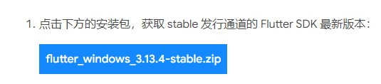

将压缩包解压到任意一个硬盘中的目录下即可

### 二、添加Path环境变量


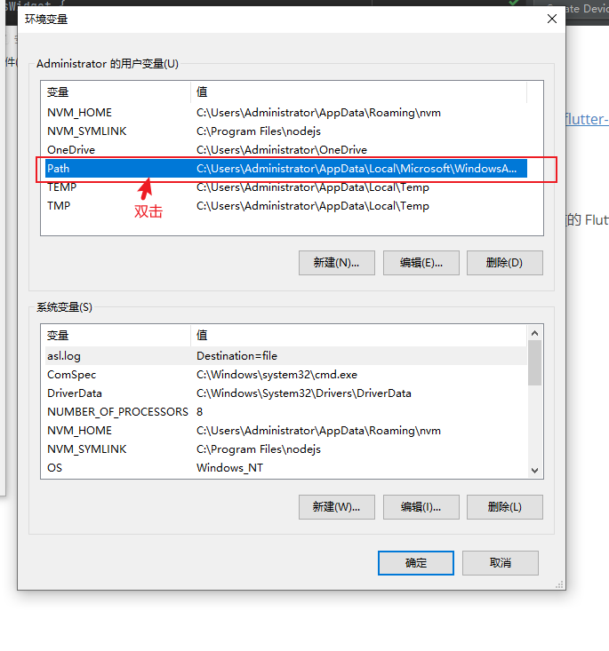


配置完后即可在控制台中使用 **flutter **... 命令

### 三、设置 Android 开发环境

##### window必须开启VT虚拟化!!!

#### 1.配置真机环境

在设备上打开 **开发者选项** 和 **USB调试** 选项

在控制台中，运行 `flutter devices` 命令来确认 Flutter 是否识别到你连接的 Android 设备。

```
现在即可使用真机运行项目 

使用 flutter create 项目名 创建项目 然后在项目的目录下控制台使用flutter run 命令运行项目
```

#### 2.配置 Android 模拟器

1.首先使用 flutter create 来创建一个项目然后用**Android Studio**来打开该项目

2.配置工具

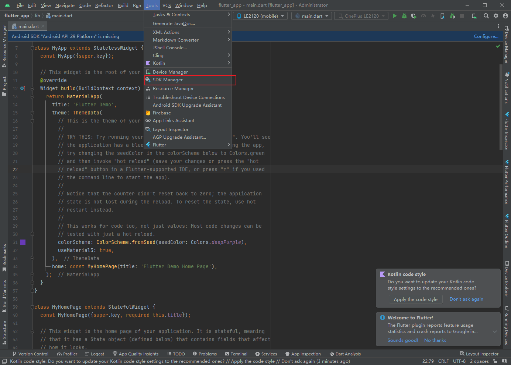

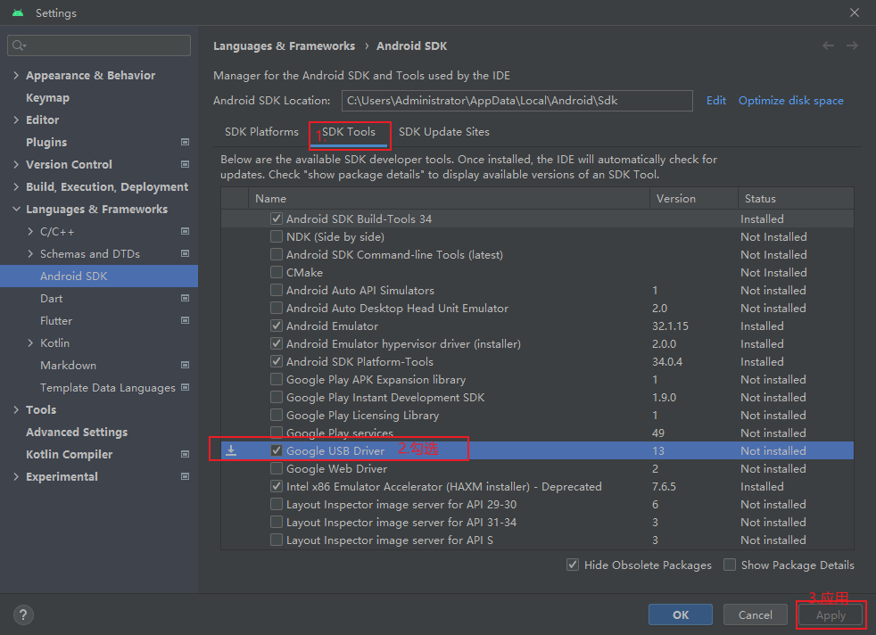

##### 3.创建模拟器

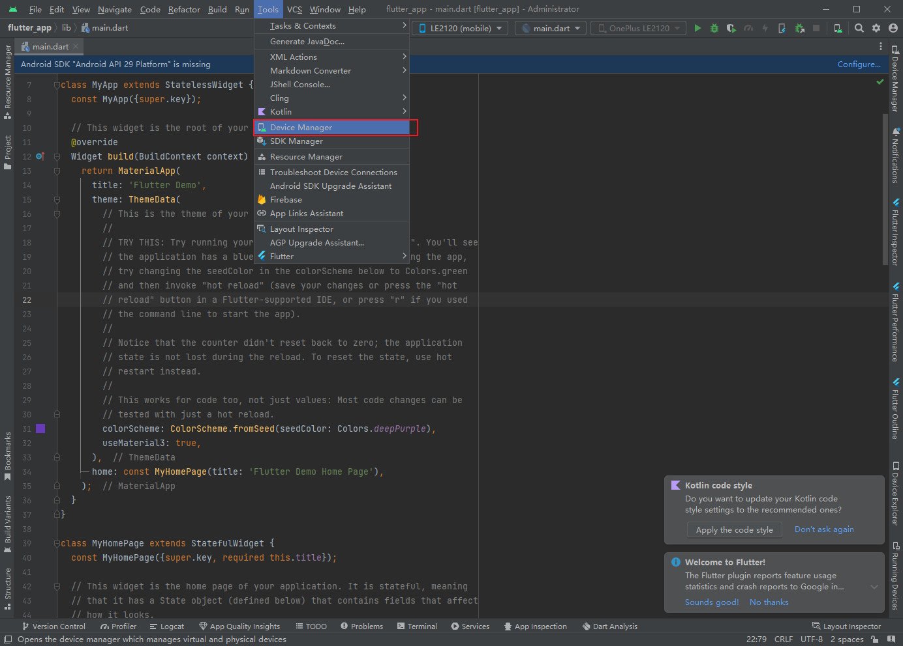

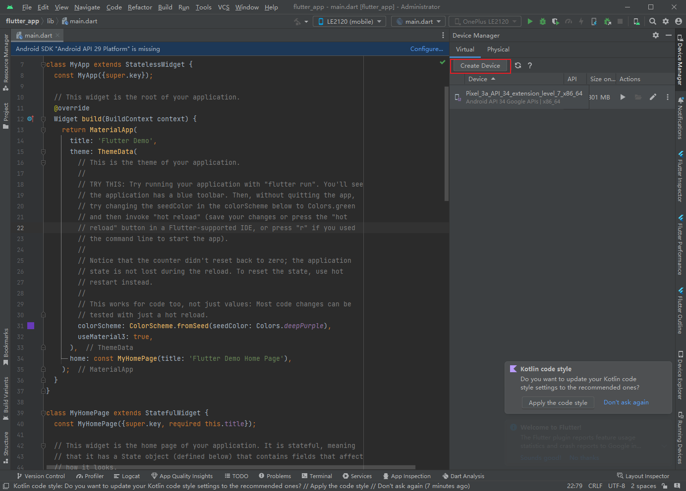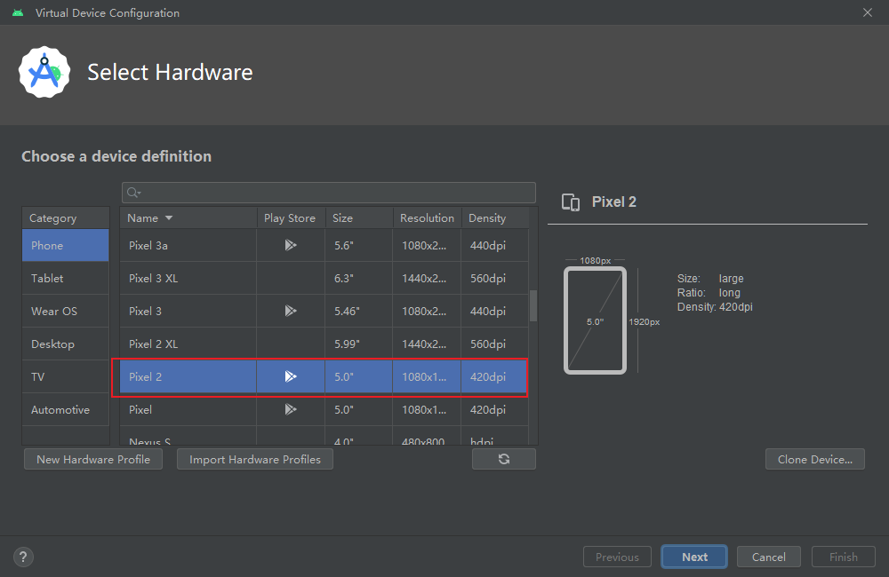

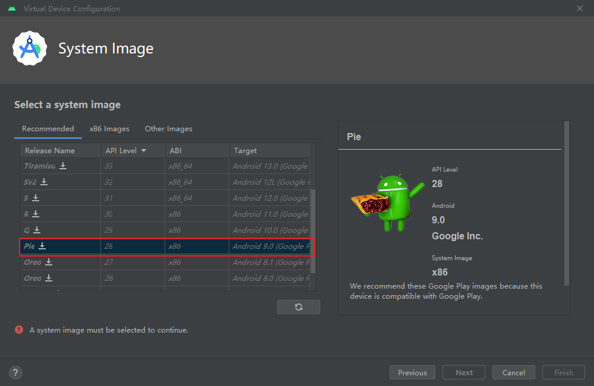

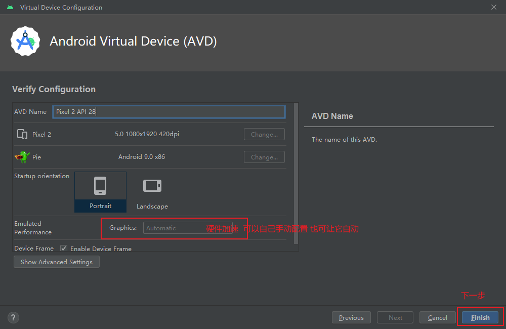

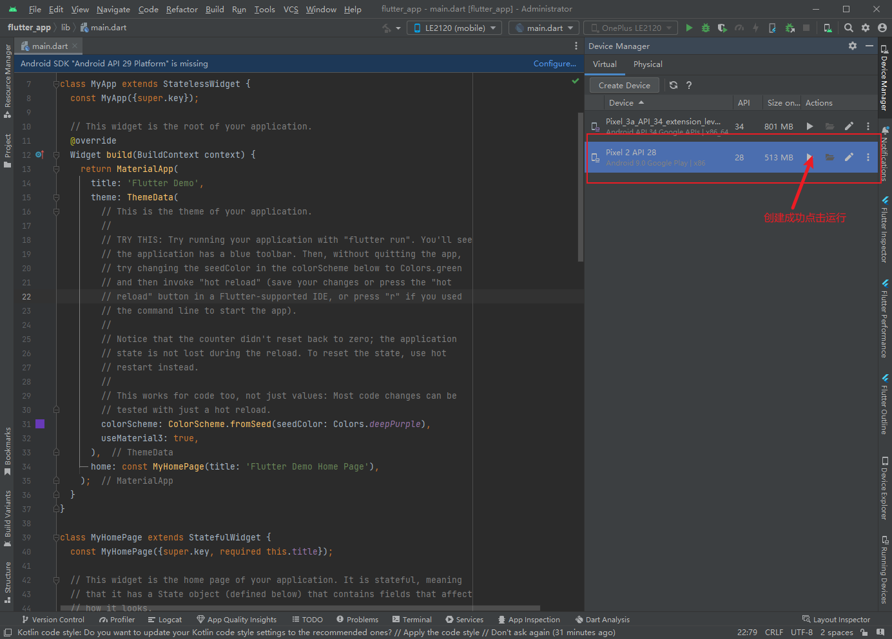


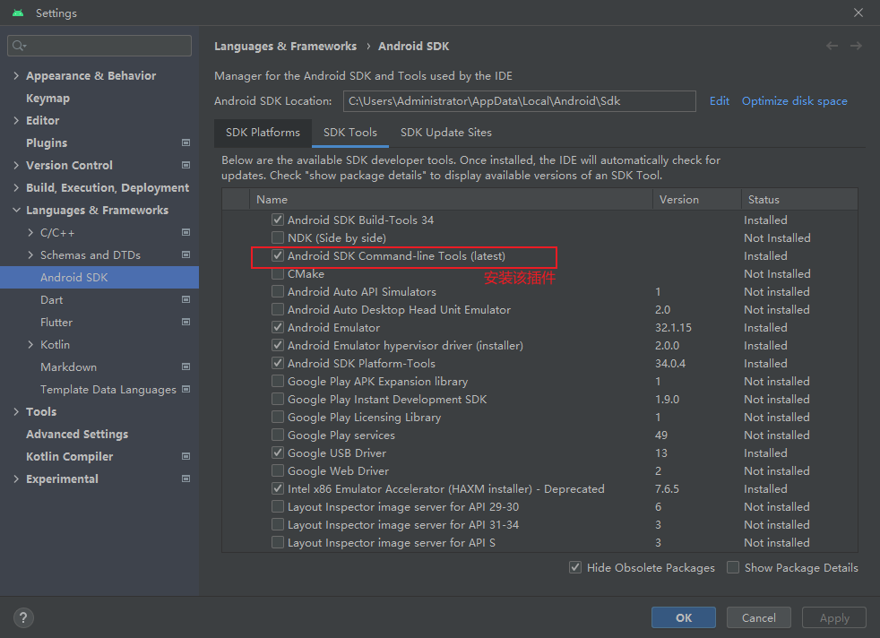

然后在控制台中输入  **flutter doctor --android-licenses** 同意安卓协议许可

### 最后运行项目前配置为flutter启动方式!!!

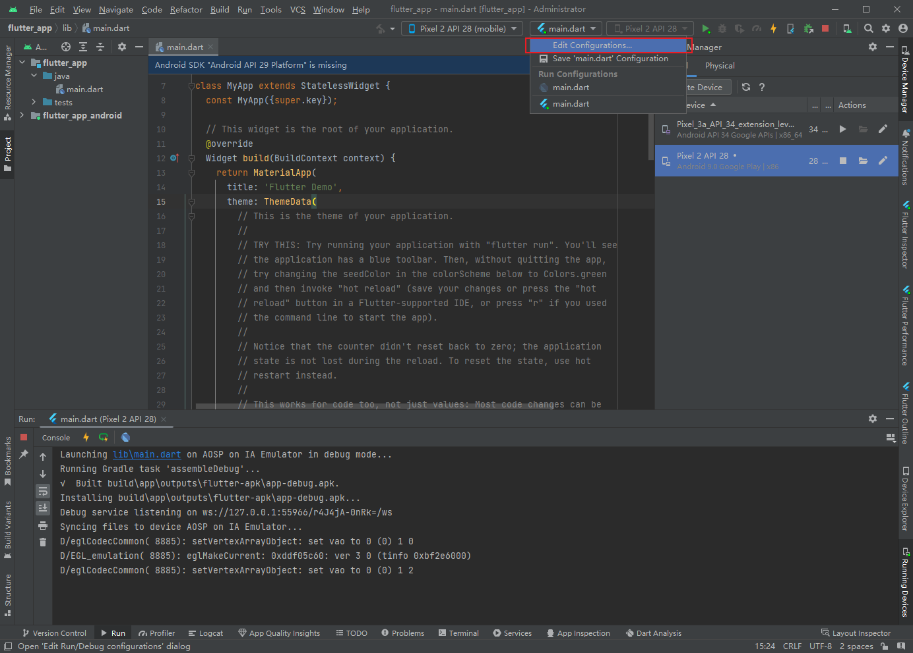

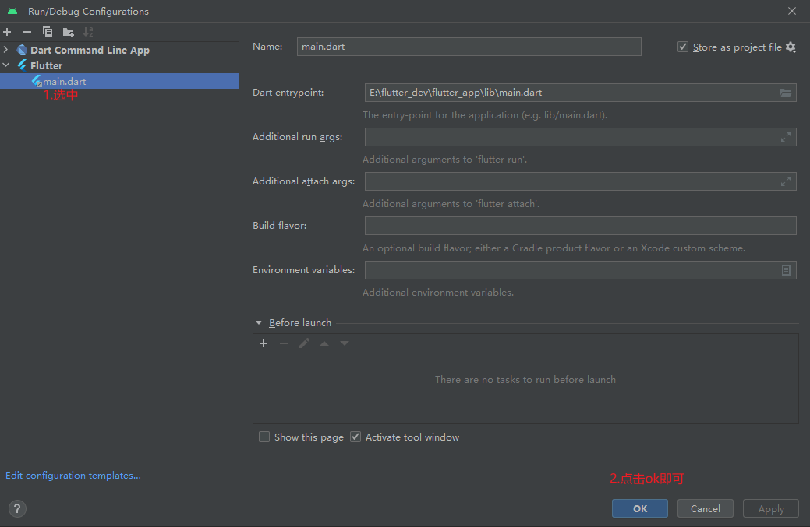

### 四、控制台使用命令来检测flutter环境配置是否正常

```
flutter doctor
```

