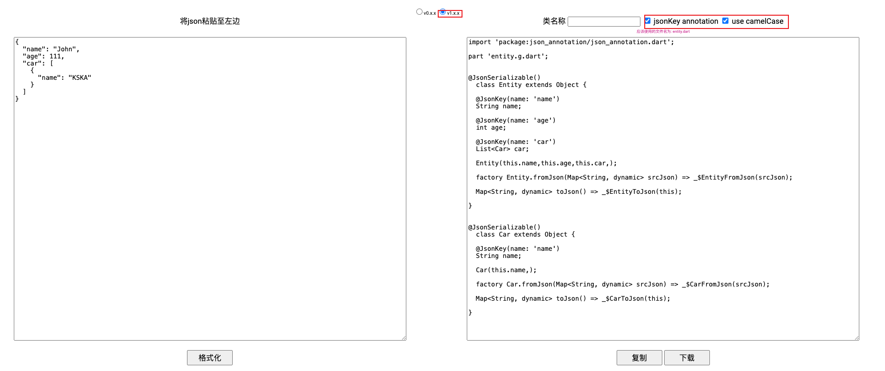
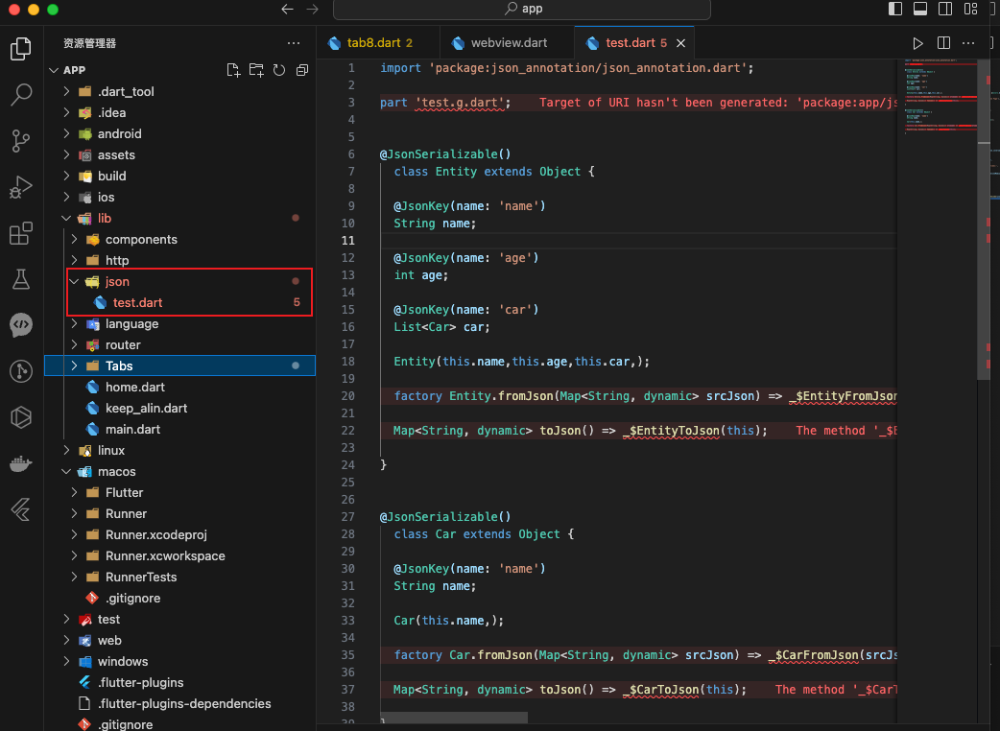
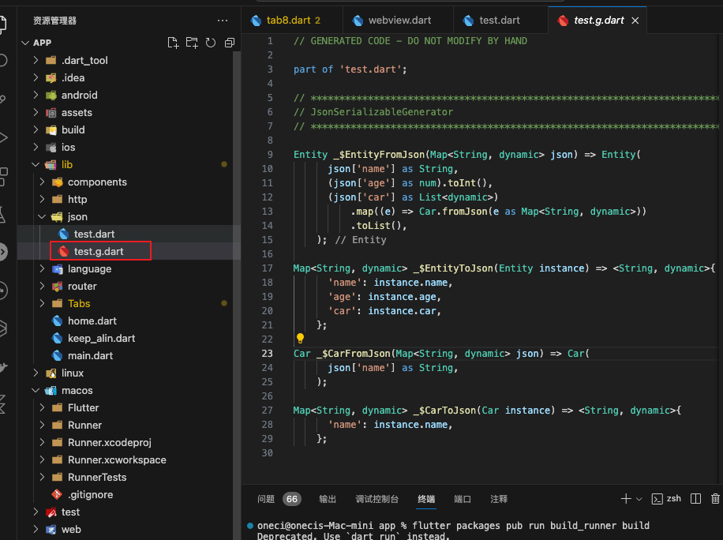
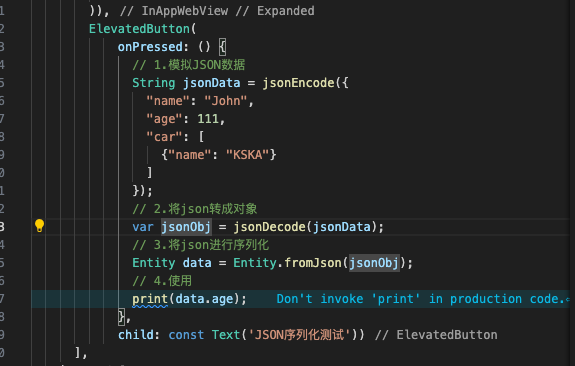
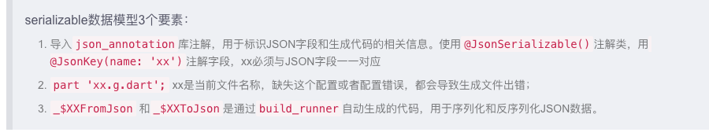

```
// 安装依赖
flutter pub add json_annotation dev:build_runner dev:json_serializable

dev:xxx表示只在开发环境使用生产环境不需要
```

#### 使用

```dart
// 这里是后端返回的json数据
{
  "name": "John",
  "age": 111,
  "car": [
    {
      "name": "KSKA"
    }
  ]
}
```

将JSON数据传入进行转换

https://caijinglong.github.io/json2dart/index_ch.html



1. 在项目的 lib目录下创建json文件夹 在该文件夹下单独创建一个dart文件用于存放转换后的数据

   ```
   转换后的数据Entity类中有fromJson和toJson方法函数
   
   fromJson用于将对象存储在当前类中
   toJson用于将对象转换成JSON格式
   ```

   



2. 然后直接在终端运行 flutter packages pub run build_runner build 命令

   当运行该命令后插件会自动查找整个项目中的上述图片已转换后的数据类进行生成xx.g.dart文件
   
   此时会生成一个 test.g.dart 文件 这个文件不需要管



3. 使用 fromJson方法

   


JSON序列化本质是将数据存储到类中，在类中去使用数据


