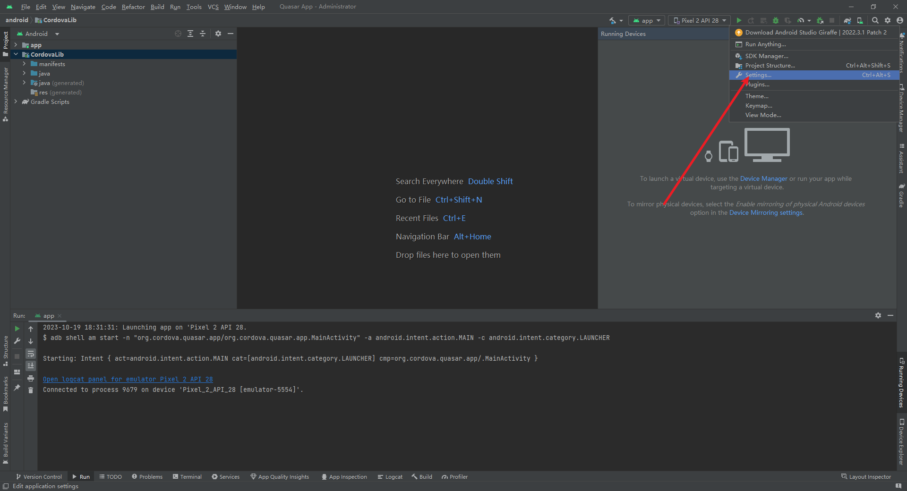
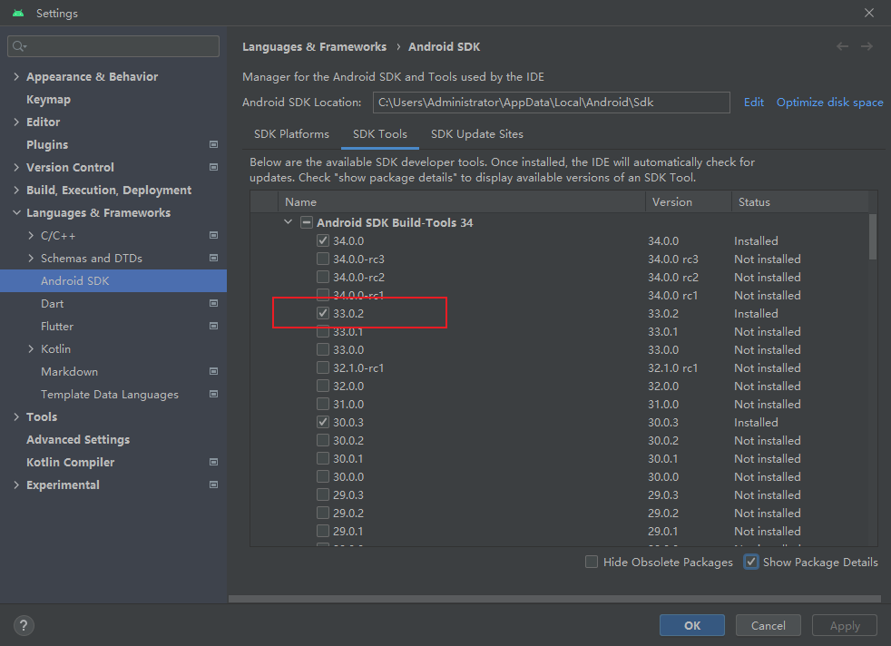
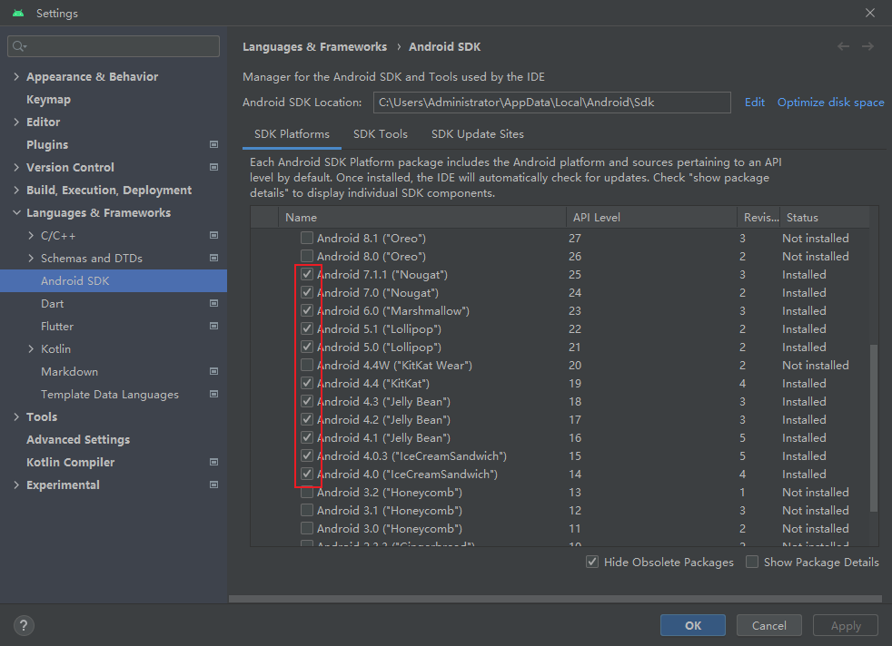
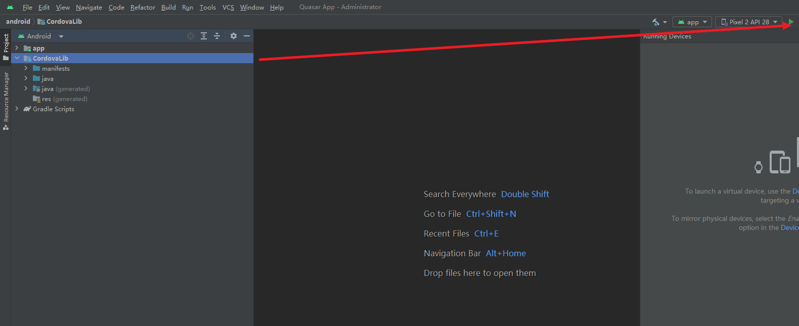

### 一、

#### 1.1

```
npm install -g cordova
```

#### 1.2








最后点Apply


#### 1.3

##### 在cmd中分别执行以下代码

```cmd
setx ANDROID_HOME "%USERPROFILE%\AppData\Local\Android\Sdk"
setx ANDROID_SDK_ROOT "%USERPROFILE%\AppData\Local\Android\Sdk"
setx path "%path%;%ANDROID_SDK_ROOT%\tools;%ANDROID_SDK_ROOT%\platform-tools;<gradle_path>\bin;"
```


### 二、

#### 1.


在当前项目终端运行quasar mode add cordova

创建好之后cd src-cordova进入

执行cordova platform add android

执行cordova requirements校验所需依赖包是否正常(类似于flutter中验证依赖包)

执行quasar dev -m android --ide 自动执行ANDROID STUDIO然后找到项目运行模拟器即可

