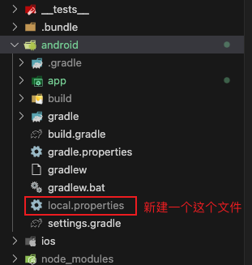

在local.properties文件中添加Android studio SDK位置路径：

对于windows用户：

```
sdk.dir = C:\\Users"MyUserName"\\AppData\\Local\\Android\\Sdk
```

对于Mac用户：

```
sdk.dir = /Users/USERNAME/Library/Android/sdk
```

对于Linux用户：

```
sdk.dir = /home/USERNAME/Android/Sdk
```