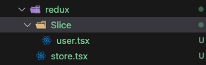

```
npm i @reduxjs/toolkit react-redux
```


#### 1.新建redux文件夹



```tsx
// store.tsx

import { configureStore } from "@reduxjs/toolkit";
import { userReducer } from "./Slice/user";

export default configureStore({
    reducer: {
        userReducer,
    },
})
```

```tsx
// user.tsx
import { createSlice } from "@reduxjs/toolkit";

const userSlice = createSlice({
    name: 'user',// 会自动生成action中的type
    initialState: { // 设置初始的state
    	id: 1,
    	username: 'kawa',
    	email: '123123@qq.com',
		},
    reducers: {//指定state的各种操作  vuex中mutations
        setUsername(state, action) { // state可以直接修改
            state.username = action.payload;
        },
        setEmail(state, action) {
            state.email = action.payload;
        },
        setId(state, action) {
            state.id = action.payload;
        }
    }
})

// 从reducers里获取所有state的操作并导出
export const { setUsername, setEmail, setId } = userSlice.actions; 
export const { reducer: userReducer } = userSlice;
```

#### 2.index.tsx

```tsx
// store
import { Provider } from 'react-redux'
import store from './redux/store'


const root = ReactDOM.createRoot(document.getElementById('root')!)
root.render(
  <Provider store={store}>
    <BrowserRouter>
      <App />
    </BrowserRouter>
  </Provider>
)
```

#### 3.使用

```tsx
import { useDispatch, useSelector } from 'react-redux'
import { setUsername } from './redux/Slice/user'


export default function App() {
  const dispatchs = useDispatch()
  const { username, id } = useSelector(state => state.userReducer)
  
	const handleClick = (val) => {
    dispatchs(setUsername(val)) // dispatchs执行actions时必须在函数内执行
  }
  return (
    <div>App</div>
  )
}
```

