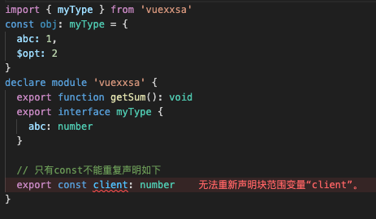

`declare module`用于**创建**或**补充**已有的模块的类型定义

#### 创建

```ts
// xxx.d.ts

// 1.1 在xxx.d.ts文件中使用时相当于创建一个 TS模块 
declare module 'vuexxsa' {
  export const client: number
  export function getSum(): void
  export interface myType {
    $opt: Number
  }
}
```

```ts
// xxx.ts

// 1.2 这个 TS模块 可以在任意.ts文件中使用import导入模块此时vscode的校验是不会报错的
// 但是如果 node_modules 文件夹中没有这个模块就会导致运行时报错
import { getN } from 'vuexxsa'
getN() // node_modules没有该模块会报错
```

#### 补充

```ts
// 在任意.ts或.d.ts文件中使用 declare module 命名的模块，如果该模块是存在的就会对该模块补充类型定义
declare module 'vuexxsa' {
  export function getSum(): void
  export interface myType {
  	abc: Number
  }
  
  // 只有const不能重复声明如下
  export const client: number
}
```


