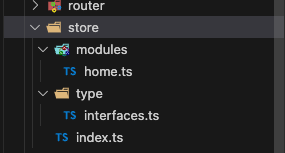

目录




```ts
// interfaces.ts

type Info = { address: string }

export interface IRootState {
  name: string
  age: number
  info: Info
}

export interface IhomeState {
  name: string
  count: number
}
```


```ts
// index.ts

import type { InjectionKey } from 'vue'
import type { IRootState, IhomeState } from './type/interfaces'
import { createStore, Store, useStore as baseUseStore } from 'vuex'
import homeM from './modules/home'

export default createStore<IRootState>({
  state: {
    name: 'root',
    age: 0,
    info: { address: '' }
  },
  getters: {
    getRootName(state) {
      return state.name
    },
    getRootInfo(state) {
      return state.info
    }
  },
  mutations: {
    setName(state, data) {
      state.name = data
    }
  },
  actions: {},
  modules: {
    homeM
  }
})

// 定义modules模块类型
type Modules = {
  homeM: IhomeState
}

export const key: InjectionKey<Store<IRootState & Modules>> = Symbol()
export function useStore() {
  return baseUseStore(key)
}

```

```ts
// home.ts

import type { Module } from 'vuex/types/index.js'
import type { IRootState, IhomeState } from '../type/interfaces'

const homeM: Module<IhomeState, IRootState> = {
  namespaced: true,
  state: {
    name: 'home',
    count: 0
  },
  getters: {
    getHomeName(state) {
      return state.name
    },
    getAllName(state, rootState) {
      return state.name + rootState.age
    }
  },
  mutations: {
    setName(state, data) {
      state.name = data
    }
  }
}

export default homeM

```

```ts
// main.ts

import store, { key } from '@/store'
const app = createApp(App)
app.use(store, key)
```

#### 使用

```ts
import { useStore } from './store'
const store = useStore()

const count = computed(() => store.state.homeM.count)
const name = computed(() => store.state.name)
```

