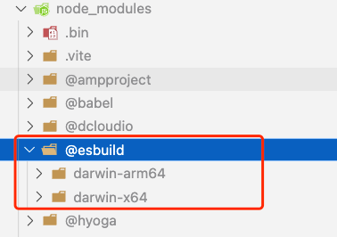

报错

```cmd
error - Error: 
You installed esbuild for another platform than the one you're currently using.
This won't work because esbuild is written with native code and needs to
install a platform-specific binary executable.

Specifically the "@esbuild/darwin-arm64" package is present but this platform
needs the "@esbuild/darwin-x64" package instead. People often get into this
situation by installing esbuild with npm running inside of Rosetta 2 and then
trying to use it with node running outside of Rosetta 2, or vice versa (Rosetta
2 is Apple's on-the-fly x86_64-to-arm64 translation service).

If you are installing with npm, you can try ensuring that both npm and node are
not running under Rosetta 2 and then reinstalling esbuild. This likely involves
changing how you installed npm and/or node. For example, installing node with
the universal installer here should work: https://nodejs.org/en/download/. Or
you could consider using yarn instead of npm which has built-in support for
installing a package on multiple platforms simultaneously.

If you are installing with yarn, you can try listing both "arm64" and "x64"
in your ".yarnrc.yml" file using the "supportedArchitectures" feature:
https://yarnpkg.com/configuration/yarnrc/#supportedArchitectures
Keep in mind that this means multiple copies of esbuild will be present.

Another alternative is to use the "esbuild-wasm" package instead, which works
the same way on all platforms. But it comes with a heavy performance cost and
can sometimes be 10x slower than the "esbuild" package, so you may also not
want to do that.
```


原因是mac的m1芯片不支持

```js
// 解决方式
// 1.找到 node_modules/@esbuild/darwin-arm64` 
// 2.将 darwin-arm64 文件夹复制一份然后改名为 darwin-x64
```

